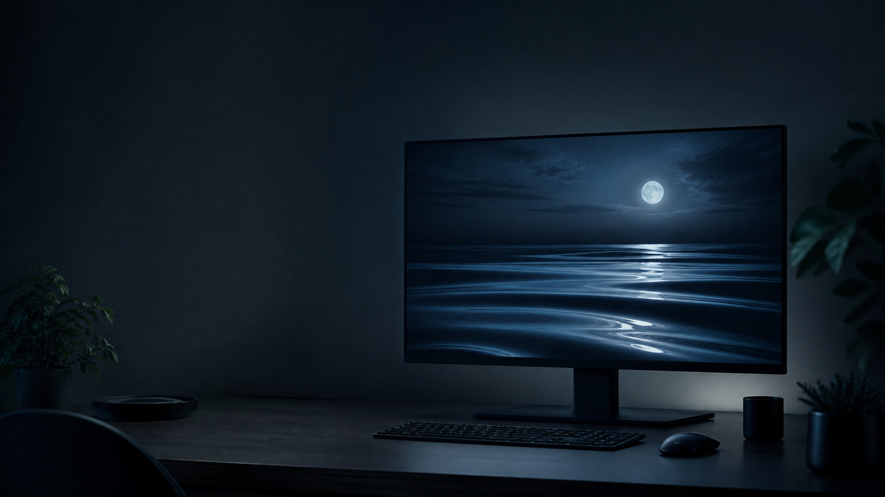

<p align="center">
  
</p>

# Gentle Drift

### A quieter screen, whenever you need it.

Gentle Drift is a collection of slow, restorative natural movements for the browser and for Windows screen savers. Flame, bamboo, water, clouds, seaweed, incense smoke, dappled light, petals, fireflies, and curtains move against a soft near-black background—made for a moment of stillness rather than another demand for attention.

<p>
  <a href="https://gentle-drift.pages.dev"><strong>Try the web experience</strong></a>
  &nbsp;·&nbsp;
  <a href="https://github.com/NAO-YA/gentle-drift/releases/latest"><strong>Download for Windows</strong></a>
</p>

## Why Gentle Drift

- **Ten quiet scenes** — choose the motion that suits the room.
- **A darker, gentler palette** — designed to feel easy on the eyes.
- **No account, no ads** — settings stay on the device.
- **Native Windows screen saver** — wake a display with water, light, or flame instead of a blank screen.

## Windows screen saver

The Windows edition is a native WPF host that renders the shared Canvas experience through WebView2. It supports the standard Windows screen saver modes:

- Full screen across connected displays
- A live preview in Windows Screen Saver Settings
- An interactive settings window for selecting a scene, palette, amount, and motion
- Mouse movement or any key returns from the screen saver

Download the latest Windows ZIP from [Releases](https://github.com/NAO-YA/gentle-drift/releases/latest), extract it to a permanent folder, right-click `GentleDrift.scr`, and choose **Install**. Then select Gentle Drift in Windows Screen Saver Settings.

## Project layout

```text
_src/index.html                 shared Canvas experience
_src/windows-screensaver/       native WPF / WebView2 screen saver host
04_output/                      browser release artifacts
.github/workflows/release.yml   builds a Windows .scr ZIP from version tags
```

## Build a Windows release

Pushing a tag such as `v0.1.0` runs the GitHub Actions workflow and creates a release containing `GentleDrift.scr` and its local web assets. See the [Windows host notes](_src/windows-screensaver/README.md) for a local Windows build.

## License

This repository is source-visible, not open source. The project and its assets are protected by [All Rights Reserved](LICENSE). Please contact the copyright holder before redistributing, repackaging, or using the work commercially.
